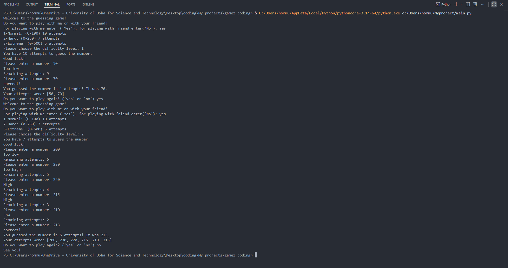

#### Guessing Game in Python

This project is a simple interactive guessing game built with Python.

The program generates a random number, and the player must guess it within a limited number of attempts. After each guess, the program provides feedback to help guide the player.

## Features
- Random number generation
- User input validation
- Interactive feedback
- Attempt tracking

## Purpose
This project was created to strengthen my Python programming skills and improve my understanding of logic, loops, and conditional statements.

## Technologies Used
- Python

## How to Run

1. Open terminal
2. Go to project folder: cd guessing game
3. Run the program : python main.py

## Screenshot

